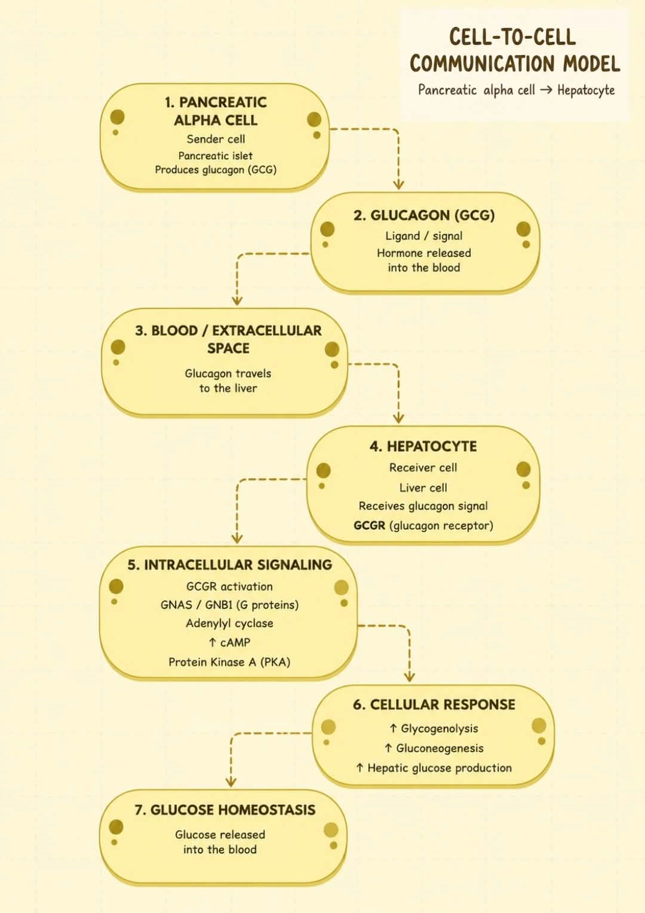

# Cell-to-Cell Communication

**Name:** Shahanta Dawn B. Balanza  
**Course:** Cell and Molecular Biology  
**Section:** B  
**Date:** October 8, 2026

## Biological Question

How can a pancreatic alpha cell communicate with a distant target cell to regulate glucose homeostasis?

## Chosen Sender Cell

**Sender cell:** Pancreatic alpha cell

**Biological context:** Pancreatic alpha cells are endocrine cells of the pancreatic islets that respond to low blood glucose by releasing glucagon.

## Signaling Molecule

**Candidate signaling molecule:** Glucagon

**Official gene:** GCG

**Signaling type:** Endocrine

Human Protein Atlas evidence shows GCG/glucagon expression associated with pancreatic islet cells, including pancreatic alpha cells, and indicates that the protein is secreted to blood.

## Receptor and Receiver Cell

**Ligand:** Glucagon (GCG)

**Receptor:** Glucagon receptor (GCGR)

**Receiver cell:** Hepatocyte

**Signaling context:** Blood glucose regulation and glucose homeostasis

OmniPath shows an interaction from GCG to GCGR, supporting GCGR as a candidate receptor for glucagon.

The Human Protein Atlas shows GCGR as tissue enriched in the liver and associated with hepatocytes, supporting hepatocytes as a biologically reasonable receiver cell.

### Part C Checkpoint

The pancreatic alpha cell produces glucagon, which can signal through the glucagon receptor (GCGR) on hepatocytes in the context of blood glucose regulation and glucose homeostasis.

## STRING Network Interpretation

A STRING protein-association network was generated using Homo sapiens with GCGR (glucagon receptor) as the starting receptor. The network contained approximately 12 proteins, including GCG, GNB1, GNB2, GNB3, GNB4, GNB5, GNAS, GNAQ, and GNG13.

The network shows functional associations between GCGR and several G-protein-related proteins. These proteins may help connect receptor activation to downstream cellular responses. However, STRING edges represent functional associations and do not necessarily indicate direct physical binding or a confirmed linear signaling pathway.

### Functional Enrichment

A relevant enriched pathway was **Reactome – Glucagon-type ligand receptors** (10 of 33 proteins; strength = 2.73; FDR = 2.14 × 10⁻²³).

Another relevant pathway was **Reactome – Glucagon signaling in metabolic regulation** (9 of 33 proteins; strength = 2.65; FDR = 1.64 × 10⁻²⁰).

### Relevant Proteins in the STRING Network

Four proteins were identified as particularly relevant to receptor-associated signaling: **GNAS, GNAQ, GNB1, and GNB2**.

**GNAS** is particularly relevant because STRING describes it as functioning downstream of GPCRs and activating adenylyl cyclase, which increases cAMP. **GNAQ** is a G-protein alpha subunit involved in transmembrane signaling. **GNB1** and **GNB2** are G-protein beta subunits involved in G-protein signaling and effector interactions.

Together, these proteins provide a plausible receptor-associated signaling connection between GCGR activation and downstream cellular responses. However, STRING associations do not by themselves establish a direct or complete signaling sequence.

## IntAct Validation

An experimentally supported interaction between the glucagon receptor (**GCGR**, UniProt P47871) and G-protein beta-1 (**GNB1**, UniProt P62873) was identified in IntAct.

The IntAct record lists **Homo sapiens** for both interacting proteins, with the interaction detected **in vitro** using **3D electron microscopy (3d-em)**. The interaction is classified by IntAct as a **physical association**. The associated publication is **PMID 32371397**, and the IntAct interaction accession is **EBI-26869098**.

This evidence supports a **direct physical association** between GCGR and GNB1 in the experimentally studied complex. It provides experimental support for the receptor-associated G-protein component of the proposed signaling model. However, this interaction record does not by itself establish the complete downstream signaling sequence or prove that every step occurs specifically in hepatocytes.

## Final Cell-to-Cell Communication Model

### Interpretation

The figure illustrates a proposed endocrine communication pathway between a pancreatic alpha cell and a hepatocyte. The pancreatic alpha cell is the sender and releases glucagon (GCG), which travels through the blood or extracellular space to reach a hepatocyte. In the receiver cell, glucagon binds to the glucagon receptor (GCGR), activating receptor-associated G-protein signaling and downstream components that include GNAS, GNB1, adenylyl cyclase, cAMP, and PKA. This signaling ultimately promotes glycogenolysis and gluconeogenesis, resulting in increased hepatic glucose production and glucose release into the blood. Human Protein Atlas (HPA) supports the sender-cell portion of the model by showing GCG expression in pancreatic islet alpha cells and indicating that glucagon is secreted to the blood. HPA also supports the receiver-cell portion because GCGR is enriched in liver tissue and associated with hepatocytes. OmniPath supports the ligand-receptor connection by showing the interaction from GCG to GCGR. STRING supports the intracellular portion of the model by identifying GCGR-associated proteins involved in G-protein signaling, including GNAS, GNB1, GNB2, and GNAQ. IntAct provides experimental evidence for a physical association between GCGR and GNB1 in Homo sapiens, detected using 3D electron microscopy. Together, these independent database findings support the proposed direction of communication from the pancreatic alpha cell to the hepatocyte and the resulting regulation of blood glucose homeostasis.

## References and Database Links

- [Human Protein Atlas – GCG (Glucagon)](https://www.proteinatlas.org/ENSG00000115263)
- [Human Protein Atlas – GCGR (Glucagon receptor)](https://www.proteinatlas.org/ENSG00000129991)
- [OmniPath Explorer – GCG/GCGR interaction](https://explore.omnipathdb.org/search?q=GCG%2C%20GCGR%2C%20&tab=interactions&species=9606)
- [STRING Database – GCGR network](https://string-db.org/)
- [IntAct – GCGR/GNB1 interaction](https://www.ebi.ac.uk/intact/)
- [PubMed – PMID 32371397](https://pubmed.ncbi.nlm.nih.gov/32371397/)

## Questions and Answers

### 1. What sender cell did you choose, and in what tissue or biological context does it act?

I chose the **pancreatic alpha cell** as the sender cell. It is an endocrine cell found in the pancreatic islets and acts in the regulation of blood glucose. When blood glucose levels are low, pancreatic alpha cells release glucagon to help increase blood glucose levels.

### 2. What signaling molecule did you identify, and what evidence supports its production or presentation by the sender cell?

The signaling molecule identified was **glucagon (GCG)**. Human Protein Atlas evidence shows GCG expression in pancreatic islet cells, including pancreatic alpha cells, and indicates that glucagon is secreted to the blood. This supports the pancreatic alpha cell as the source of the signal.

### 3. What receptor receives the signal, and which receiver cell did you select?

The receptor is the **glucagon receptor (GCGR)**, and the selected receiver cell is the **hepatocyte**. Human Protein Atlas shows GCGR as enriched in liver tissue and associated with hepatocytes. OmniPath also shows an interaction between GCG and GCGR, supporting the proposed ligand-receptor relationship.

### 4. What type of cell-to-cell signaling is represented: paracrine, endocrine, autocrine, or contact dependent?

The signaling is **endocrine signaling** because glucagon is released by pancreatic alpha cells into the blood and travels to a distant target tissue, particularly the liver, where it acts on hepatocytes.

### 5. Which proteins in your STRING network appear most relevant to the receptor-associated response? Explain briefly.

The proteins most relevant to the receptor-associated response are **GNAS, GNAQ, GNB1, and GNB2**. GNAS is particularly relevant because it functions downstream of GPCRs and can activate adenylyl cyclase, increasing cAMP. GNAQ, GNB1, and GNB2 are components of heterotrimeric G-protein signaling and can participate in receptor-associated signal transduction. These proteins provide a plausible connection between GCGR activation and downstream cellular responses.

### 6. What enriched pathway or biological process is consistent with your proposed mechanism?

Two relevant enriched pathways were identified in STRING: **Reactome – Glucagon-type ligand receptors** and **Reactome – Glucagon signaling in metabolic regulation**. The glucagon-type ligand receptor pathway included 10 of 33 proteins with an FDR of 2.14 × 10⁻²³, while the glucagon signaling in metabolic regulation pathway included 9 of 33 proteins with an FDR of 1.64 × 10⁻²⁰. These pathways are consistent with the proposed glucagon-GCGR signaling mechanism.

### 7. What did IntAct show for the molecular interaction you examined? What type of evidence was reported?

IntAct showed an experimentally supported interaction between **GCGR (P47871)** and **GNB1 (P62873)** in *Homo sapiens*. The interaction was detected **in vitro** using **3D electron microscopy (3d-em)** and was classified as a **physical association**. The IntAct interaction accession is **EBI-26869098**, and the associated publication is **PMID 32371397**. This provides experimental evidence supporting a physical association between the glucagon receptor and a G-protein component.

### 8. Which parts of your final model are strongly supported, and which parts remain an inference?

The sender cell, GCG expression in pancreatic alpha cells, glucagon secretion to the blood, GCGR association with hepatocytes, and the GCG-GCGR interaction are strongly supported by the Human Protein Atlas and OmniPath evidence. The GCGR-GNB1 physical association is also experimentally supported by IntAct. The STRING network supports associations between GCGR and G-protein-related proteins. However, the complete sequence from GCGR activation through GNAS, adenylyl cyclase, cAMP, and PKA to the final metabolic response is a proposed synthesis of the evidence and known signaling biology rather than something demonstrated entirely by one database.

### 9. What cellular response is expected in the receiver cell, and why?

The expected response in the hepatocyte is increased **glycogenolysis and gluconeogenesis**, leading to increased hepatic glucose production and release of glucose into the blood. This response is consistent with the role of glucagon in maintaining blood glucose levels during low-glucose conditions and with the enriched glucagon-related pathways identified in STRING.
