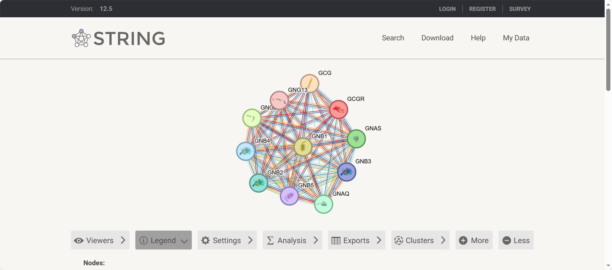
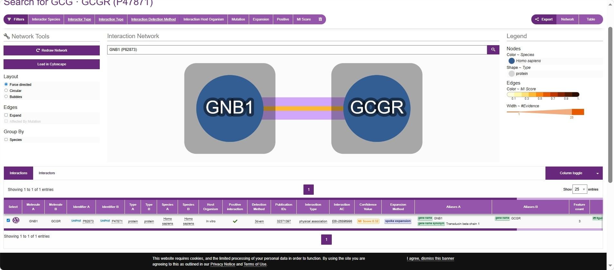

# Cell-to-Cell Communication

## Biological Question

How can a pancreatic alpha cell communicate with a distant target cell to regulate glucose homeostasis?

## Chosen Sender Cell

**Sender cell:** Pancreatic alpha cell

**Biological context:** Pancreatic alpha cells are endocrine cells of the pancreatic islets that respond to low blood glucose by releasing glucagon.

## Signaling Molecule

**Candidate signaling molecule:** Glucagon

**Official gene:** GCG

**Signaling type:** Endocrine

Human Protein Atlas evidence shows GCG/glucagon expression associated with pancreatic islet cells, including pancreatic alpha cells, and indicates that the protein is secreted to blood.

## Receptor and Receiver Cell

**Ligand:** Glucagon (GCG)

**Receptor:** Glucagon receptor (GCGR)

**Receiver cell:** Hepatocyte

**Signaling context:** Blood glucose regulation and glucose homeostasis

OmniPath shows an interaction from GCG to GCGR, supporting GCGR as a candidate receptor for glucagon.

The Human Protein Atlas shows GCGR as tissue enriched in the liver and associated with hepatocytes, supporting hepatocytes as a biologically reasonable receiver cell.

### Part C Checkpoint

The pancreatic alpha cell produces glucagon, which can signal through the glucagon receptor (GCGR) on hepatocytes in the context of blood glucose regulation and glucose homeostasis.

## STRING Network Interpretation

A STRING protein-association network was generated using Homo sapiens with GCGR (glucagon receptor) as the starting receptor. The network contained approximately 12 proteins, including GCG, GNB1, GNB2, GNB3, GNB4, GNB5, GNAS, GNAQ, and GNG13.

The network shows functional associations between GCGR and several G-protein-related proteins. These proteins may help connect receptor activation to downstream cellular responses. However, STRING edges represent functional associations and do not necessarily indicate direct physical binding or a confirmed linear signaling pathway.

### Functional Enrichment

A relevant enriched pathway was **Reactome – Glucagon-type ligand receptors** (10 of 33 proteins; strength = 2.73; FDR = 2.14 × 10⁻²³).

Another relevant pathway was **Reactome – Glucagon signaling in metabolic regulation** (9 of 33 proteins; strength = 2.65; FDR = 1.64 × 10⁻²⁰).

### Relevant Proteins in the STRING Network

Four proteins were identified as particularly relevant to receptor-associated signaling: **GNAS, GNAQ, GNB1, and GNB2**.

**GNAS** is particularly relevant because STRING describes it as functioning downstream of GPCRs and activating adenylyl cyclase, which increases cAMP. **GNAQ** is a G-protein alpha subunit involved in transmembrane signaling. **GNB1** and **GNB2** are G-protein beta subunits involved in G-protein signaling and effector interactions.

Together, these proteins provide a plausible receptor-associated signaling connection between GCGR activation and downstream cellular responses. However, STRING associations do not by themselves establish a direct or complete signaling sequence.

## IntAct Validation

An experimentally supported interaction between the glucagon receptor (**GCGR**, UniProt P47871) and G-protein beta-1 (**GNB1**, UniProt P62873) was identified in IntAct.

The IntAct record lists **Homo sapiens** for both interacting proteins, with the interaction detected **in vitro** using **3D electron microscopy (3d-em)**. The interaction is classified by IntAct as a **physical association**. The associated publication is **PMID 32371397**, and the IntAct interaction accession is **EBI-26869098**.

This evidence supports a **direct physical association** between GCGR and GNB1 in the experimentally studied complex. It provides experimental support for the receptor-associated G-protein component of the proposed signaling model. However, this interaction record does not by itself establish the complete downstream signaling sequence or prove that every step occurs specifically in hepatocytes.

## Final Cell-to-Cell Communication Model

*To be completed after the database analyses.*

## References and Database Links

- Human Protein Atlas
- OmniPath
- STRING
- IntAct
