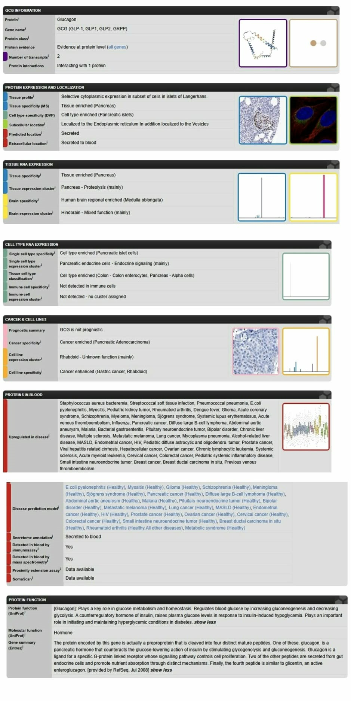
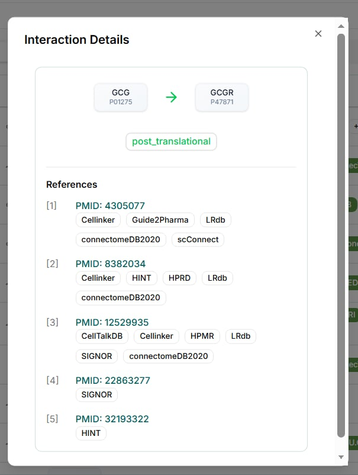
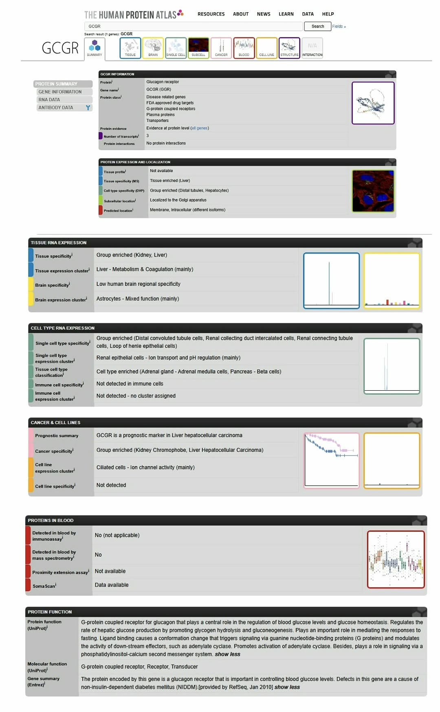

# Cell-to-Cell Communication

## Biological Question

How can a pancreatic alpha cell communicate with a distant target cell to regulate glucose homeostasis?

## Chosen Sender Cell

**Sender cell:** Pancreatic alpha cell

**Biological context:** Pancreatic alpha cells are endocrine cells of the pancreatic islets that respond to low blood glucose by releasing glucagon.

## Signaling Molecule

**Candidate signaling molecule:** Glucagon

**Official gene:** GCG

**Signaling type:** Endocrine

Human Protein Atlas evidence shows GCG/glucagon expression associated with pancreatic islet cells, including pancreatic alpha cells, and indicates that the protein is secreted to blood.

## Receptor and Receiver Cell

**Ligand:** Glucagon (GCG)

**Receptor:** Glucagon receptor (GCGR)

**Receiver cell:** Hepatocyte

**Signaling context:** Blood glucose regulation and glucose homeostasis

OmniPath shows an interaction from GCG to GCGR, supporting GCGR as a candidate receptor for glucagon.

The Human Protein Atlas shows GCGR as tissue enriched in the liver and associated with hepatocytes, supporting hepatocytes as a biologically reasonable receiver cell.

### Part C Checkpoint

The pancreatic alpha cell produces glucagon, which can signal through the glucagon receptor (GCGR) on hepatocytes in the context of blood glucose regulation and glucose homeostasis.

## Signaling Network

*To be investigated using STRING.*

## Experimentally Supported Interaction

*To be investigated using IntAct.*

## Final Cell-to-Cell Communication Model

*To be completed after the database analyses.*

## References and Database Links

- Human Protein Atlas
- OmniPath
- STRING
- IntAct
